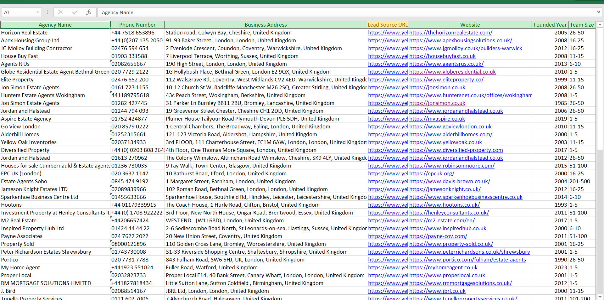
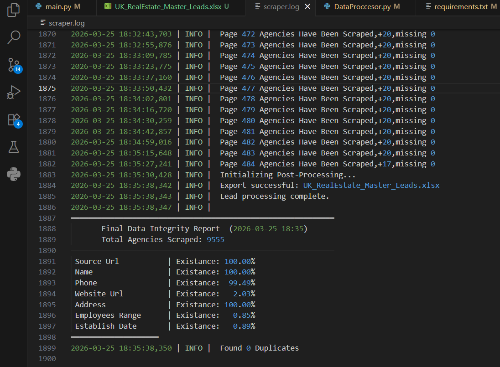

# 🚀 High-Resilience UK Real Estate Data Pipeline (9,600+ Leads)

## 💰 Business Value
Transforming fragmented web data into actionable business intelligence. This pipeline provides a **curated database of 9,555 UK Real Estate Agencies**, specifically architected for B2B sales teams, marketing agencies, and CRM integration. By implementing a multi-tier segmentation logic, this tool identifies the "Gold" 2% of the market with complete firmographic profiles, saving hours of manual prospecting.

## 🛠️ Tech Stack
- **Engine:** `Python 3.10` utilizing `AsyncIO` for high-concurrency extraction.
- **Networking:** `HTTPX` for resilient, non-blocking requests.
- **Data Architecture:** `Pandas` for advanced data cleaning and multi-sheet Excel serialization.
- **Resilience:** Custom-built `Retry Logic` and `Checkpoint System` to handle network throttling and anti-bot measures.

## 📊 Dataset Overview (9,555 Total Leads)
The pipeline is designed to extract 100% of publicly listed metadata from the source directory.

### Multi-Tier Lead Segmentation:
| Tier | Count | Key Features |
| :--- | :--- | :--- |
| **🥇 Gold** | ~80 | Premium profiles with **Team Size, Founding Year, and Website**. |
| **🥈 Platinum** | ~120 | High-quality leads with **Phone & Direct Website URLs**. |
| **🥉 Regular** | ~9,355 | Essential contact data: **Agency Name, Phone, and Address**. |

## 🔍 Data Quality & Transparency
### Primary Data Preview (Gold Tier)

*High-fidelity snapshot of the Gold Tier dataset, highlighting structural integrity.*

### Source Data Density Audit
> **Transparency Note:** Our engine is architected to capture **100% of publicly listed metadata**. Please note that the source directory provides Website URLs and Firmographic data (Team Size/Founded Year) for approximately **2%** of its total listings. Our pipeline has successfully identified and isolated **Every single available instance** of this data into the Gold/Platinum tiers.

## 📈 Integrity & Performance Logs

*Automated audit logs confirming the extraction of 9,555 records with zero data loss during serialization.*

## 🚀 Key Features
- **Scalability:** Optimized to handle 9,000+ records in a single execution cycle.
- **Resilience:** Built-in crash recovery; the pipeline resumes exactly where it left off.
- **CRM Integration:** Outputs are pre-formatted for immediate upload to HubSpot, Salesforce, or Pipedrive.

---
**Developed by Ammar Mostafa**
*Data Extraction Specialist | Building Scalable B2B Lead Gen Pipelines*
📧 [ammar.mostafa.dev@gmail.com](mailto:ammar.mostafa.dev@gmail.com)